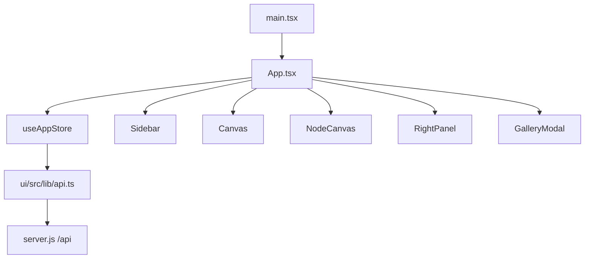

# Frontend Architecture

The current `ima2-gen` web UI is the React app under `ui/src/`. The server serves the built bundle under `ui/dist/`. The old single-file HTML UI remains as `public/index.html.legacy`, but it is not the active entrypoint.

This matters because README and older devlog entries still contain traces of the vanilla HTML UI. Actual UI work should target React components, the Zustand store, `ui/src/lib/api.ts`, and `ui/src/index.css`. Fixing the legacy HTML file will not change the active app.

Start UI work at `App.tsx` to understand how classic canvas and node canvas diverge. Server calls are in `ui/src/lib/api.ts`. State is centralized in `ui/src/store/useAppStore.ts`. For screen-level structure, start with `Sidebar`, `Canvas`, `NodeCanvas`, `RightPanel`, and `GalleryModal`.

---

## Render Flow

`App.tsx` hydrates history, loads sessions, reconciles inflight jobs, and starts polling on mount. If UI mode is `classic`, it renders `Canvas`; if UI mode is `node`, it renders `NodeCanvas`. Before unload or visibility changes, it flushes the graph save beacon.

## Major Areas

| Area | Main files | Responsibility |
|---|---|---|
| App shell | `ui/src/App.tsx` | Initialization, storage sync, beforeunload save, canvas switch |
| Left panel | `Sidebar.tsx`, `PromptComposer.tsx`, `ProviderSelect.tsx` | Prompt, references, provider, generate entry |
| Center canvas | `Canvas.tsx`, `NodeCanvas.tsx`, `ImageNode.tsx` | Classic image display or graph canvas |
| Right panel | `RightPanel.tsx`, `SizePicker.tsx`, `CostEstimate.tsx` | Quality, size, format, moderation, count |
| History | `HistoryStrip.tsx`, `GalleryModal.tsx`, `ResultActions.tsx` | Saved image browsing and actions |
| Status | `InFlightList.tsx`, `Toast.tsx`, `BillingBar.tsx` | Pending jobs, notifications, billing/provider status |
| i18n | `ui/src/i18n/index.ts`, `ko.json`, `en.json` | Locale load/save and translation lookup |

## State Model

| State group | Location | Description |
|---|---|---|
| Generation options | `useAppStore.ts` | Provider, quality, size, format, moderation, count |
| Prompt/reference | `useAppStore.ts` | Prompt, reference images, add/remove/clear helpers |
| Classic history | `useAppStore.ts` plus `/api/history` | Current image, history, gallery |
| Inflight | `useAppStore.ts` plus `/api/inflight` | localStorage-backed pending jobs and polling |
| Node graph | `useAppStore.ts` plus sessions API | Nodes, edges, graphVersion, session actions |
| UI preferences | `localStorage` | Right panel state, UI mode, selected filename, locale |

## API Client

| Function | Endpoint | Used by |
|---|---|---|
| `postGenerate` | `POST /api/generate` | Classic generation |
| `postEdit` | `POST /api/edit` | Edit flow |
| `getHistory` | `GET /api/history` | History strip and gallery |
| `getHistoryGrouped` | `GET /api/history?groupBy=session` | Session-grouped history |
| `deleteHistoryItem` | `DELETE /api/history/:filename` | Asset delete |
| `restoreHistoryItem` | `POST /api/history/:filename/restore` | Undo/restore |
| `getInflight` | `GET /api/inflight` | Pending reconciliation |
| `postNodeGenerate` | `POST /api/node/generate` | Node-mode generation |
| Session helpers | `/api/sessions/*` | Graph session list/load/save |
| `getOAuthStatus` | `GET /api/oauth/status` | Provider readiness |
| `getBilling` | `GET /api/billing` | Billing bar and API status |

## Classic UI And Node UI

| Mode | Condition | Main component | State flow |
|---|---|---|---|
| Classic | Default UI | `Canvas.tsx` | Sends prompt to `/api/generate`, then updates current image/history |
| Node | Desktop branching mode | `NodeCanvas.tsx` | Calls `/api/node/generate` per node, imports history assets through `/api/node/import`, and saves the graph to the session |

Node mode uses `@xyflow/react`. Empty canvas creates a root node. Dragging an edge from an existing node can create a child node. Session loading displays a canvas overlay.

## Style And Layout

| File | Current signal | Caution |
|---|---|---|
| `ui/src/index.css` | 1580 lines | Large structural changes can easily create CSS drift |
| `ui/src/components/*.tsx` | 1703 lines | Component class names and CSS are tightly coupled |
| `ui/dist/` | Build output | Do not edit directly |
| `public/index.html.legacy` | Legacy artifact | Do not use it as the source for new active UI behavior |

## Change Checklist

- [ ] If a new API call is added, update `ui/src/lib/api.ts` and `[[03-server-api]]`.
- [ ] If store shape changes, check classic, node, and localStorage migration paths.
- [ ] If node-mode UI changes, update `[[05-node-mode]]`.
- [ ] Record major CSS changes alongside component ownership.
- [ ] If a change references legacy HTML, re-check it against the active UI.

## Change Log

- 2026-04-23: Documented the active React UI architecture.
- 2026-04-23: Translated this document from Korean to English.

Previous document: `[[03-server-api]]`

Next document: `[[05-node-mode]]`
